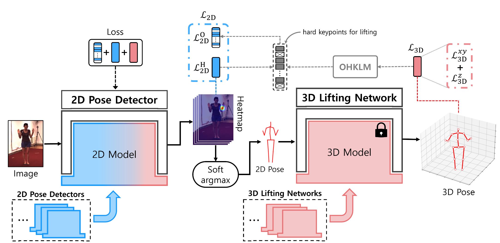
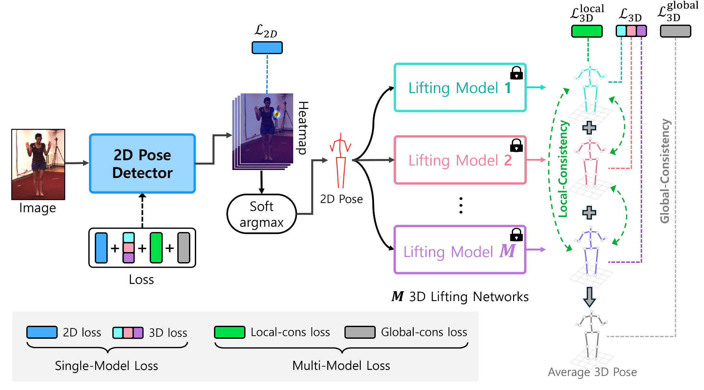

# L2D-Pose

The code for the ACCV 2024 paper "Learning 2D Human Poses for Better 3D Lifting via Multi-Model 3D-Guidance" by Sanghyeon Lee, Yoonho Hwang, and Jong Taek Lee.

You can cite this paper as: 

@InProceedings{Lee_2024_ACCV,
    author    = {Lee, Sanghyeon and Hwang, Yoonho and Lee, Jong Taek},
    title     = {Learning 2D Human Poses for Better 3D Lifting via Multi-Model 3D-Guidance},
    booktitle = {Proceedings of the Asian Conference on Computer Vision (ACCV)},
    month     = {December},
    year      = {2024},
    pages     = {3344-3361}
}

## Overview

### Single-Model 3D-Guided Training Approach


### Multi-Model 3D-Guided Training Approach


## Introduction
This is an official implementation code of "Learning 2D Human Poses for Better 3D Lifting via Multi-Model 3D-Guidance". In this work, we present a method of training the 2D pose detector to perform better in 3D lifting using 3D data. Plug-and-play is possible for the 2D pose detector and 3D lifting network that the user wants.

## Datasets
- Human3.6M dataset can be downloaded from the official cite of [Human3.6M Dataset](http://vision.imar.ro/human3.6m/description.php).

- Panoptic dataset can be downloaded from the official cite of [CMU Panoptic Dataset](http://domedb.perception.cs.cmu.edu/).
  
We provide the data preprocessing code necessary for the 3D-guided training method we presented.

## Used Pose Estimation Model

### 2D Pose Detector
- [HRnet](https://github.com/leoxiaobin/deep-high-resolution-net.pytorch) : This is an official pytorch implementation of [Deep High-Resolution Representation Learning for Human Pose Estimation](https://arxiv.org/abs/1902.09212).

### 3D Lifting Network

- [SimpleBaseline](https://github.com/una-dinosauria/3d-pose-baseline) : This repository is an official implementation of the paper [A simple yet effective baseline for 3d human pose estimation](https://arxiv.org/pdf/1705.03098.pdf).
- [VideoPose](https://github.com/facebookresearch/VideoPose3D) : This repository is an official implementation of the paper [3D human pose estimation in video with temporal convolutions and semi-supervised training](https://arxiv.org/abs/1811.11742).
- [IGANet](https://github.com/xiu-cs/IGANet) : This repository is an official implementation of the paper [IGANet:Interweaved Graph and Attention Network for 3D Human Pose Estimation](https://arxiv.org/abs/2304.14045).
- [MixSTE](https://github.com/JinluZhang1126/MixSTE) : This repository is an official implementation of the paper [MixSTE: Seq2seq Mixed Spatio-Temporal Encoder for 3D Human Pose Estimation in Video](https://arxiv.org/abs/2203.00859)
  
We provide the code for HRnet and SimpleBaseline, the basic models used in the experiment. You can get and use other 2d pose detectors and 3d lifting networks you want.

##  Setup
1. Clone this repository `{ROOT}`.
2. Create and activate a `t3d` conda environment using the provided environment:
   ```
   conda env create -f L2D.yaml
   conda activate L2D
   ```
## Train

```
python run/train_hrnet.py --cfg model_2d/hrnet/experiments/h36m/w32_384x288_adam_lr1e-3.yaml --loss_single_w 0.8 --gpu_id 0 --loss_3d --loss_3d_z --model_3d sb --ohklm 
```

## Test

```
python run/valid_hrnet.py --cfg model_2d/hrnet/experiments/h36m/w32_384x288_adam_lr1e-3.yaml --model_dir ${model_weight_dir} --gpu_id 0 --model_3d sb
```
#
